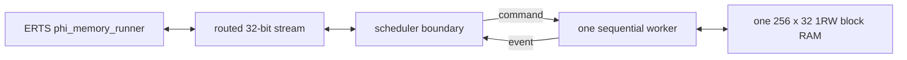

# Phi scheduler and state-storage experiment

This directory contains the implementation ablations used to locate the area
cost of the generated distance-three phi-decoder. They are executable
experiments, not backend components or reusable example APIs.

The files answer four progressively narrower questions:

1. How small can the fixed distance-three experiment become when actor and
   mailbox semantics are replaced by one globally scheduled RTL machine?
2. How much of the remaining XLS design is arithmetic, and how much is
   replicated actor state?
3. Can a time-multiplexed worker keep its state in one inferred block RAM and
   still service the same routed ERTS protocol?
4. Once the generated actor deployment uses shared, pipelined schedulers, how
   much throughput does it recover by partitioning each phi family over two or
   three executors?
5. Is the remaining full-demo latency in the decoder, or in the simulated
   phenomenological source network that will not exist in the real apparatus?
6. Can the mailbox manager pipeline distinct actor activations at II=1 without
   adding another copy of actor or mailbox state?

The experiment keeps the application boundary honest: the raw and BRAM
implementations accept the same cutoff, correction-update, and measurement
query packets as the generated topology. Their bridge runs use the unchanged
`phi_memory_runner` and compare every ordered correction and every final data
qubit with a witness produced by the CPU actor deployment.

## Implementations

- `phi_memory_raw_d3.sv` is a fixed-size handwritten SystemVerilog baseline.
  It uses one global schedule and one restoring divider.
- `phi_relax_lane.x` and `phi_relax_bank.sv` isolate the Q15.16 relaxation
  datapath and its spatial/temporal replication curve.
- `phi_sequential_core.x` is the same global schedule expressed in DSLX, with
  state held in register arrays.
- `phi_sequential_bram_core.x` moves the sequential worker's ten-word spatial
  records behind an XLS 1RW RAM interface.
- `phi_memory_scheduler_boundary.sv` and `phi_memory_bram_top.sv` adapt that
  worker to the routed 32-bit application protocol.
- `run_shard_sweep.sh` exercises the generated implementation with one, two,
  and three interleaved schedulers per phi family. `synth_shard_sweep.sh` maps
  the corresponding topology cores on a common boundary-free scope.



## Results

The current out-of-context XC7 mappings are:

| implementation | estimated logic cells | flip-flops | LUT1-LUT6 | `RAM32M` | `RAMB18E1` | `DSP48E1` |
| --- | ---: | ---: | ---: | ---: | ---: | ---: |
| raw SystemVerilog with boundary | 2,063 | 708 | 2,358 | 148 | 0 | 0 |
| register-array DSLX core | 9,065 | 4,525 | 9,495 | 0 | 0 | 1 |
| initial one-RAM DSLX core | 1,248 | 890 | 1,755 | 0 | 1 | 1 |
| interactive one-RAM worker with boundary | 1,723 | 1,293 | 2,319 | 0 | 1 | 1 |

These are mapping results, not placement, routing, or timing closure. The
scopes also differ slightly: the initial one-RAM row was a summary-only worker,
while the interactive row includes its real command/event interface and routed
adapter. Moving the spatial state behind the RAM port removed 7,817 estimated
logic cells and 3,635 flip-flops from the register-array DSLX result.

The direct BRAM protocol regression takes 175,408 clocks. It checks the ordered
84-correction trace, the 45/39 X/Z split, and all 18 final measurement replies.
The ERTS/VPI run matches the complete CPU witness and takes about 151 seconds on
the current local UTM.

The relaxation sweep shows the explicit area/latency control available by
replicating only the arithmetic worker:

| relaxation lanes | estimated logic cells | estimated diffusion clocks |
| ---: | ---: | ---: |
| 1 | 889 | 2,772 |
| 2 | 1,774 | 1,386 |
| 4 | 3,554 | 770 |
| 9 | 8,015 | 308 |
| 18 | 15,997 | 154 |

The principal result is therefore not that all actors should be collapsed into
one machine. It is that actor implementation lanes and actor state count need
not scale together. A generated deployment can choose several workers, assign
many logical instances to each, and keep their distinct states in RAM.

The generated scheduler sweep gives the following D3 results. Every row passes
the complete ERTS-versus-native-Icarus comparison: all 84 accepted corrections
and all 18 final data-qubit replies agree with the CPU actor deployment.

| phi executors per plane | total schedulers | application clocks | mean clocks per decoder step | steps/s at 200 MHz | estimated logic cells | flip-flops | LUT1-LUT6 | `DSP48E1` |
| ---: | ---: | ---: | ---: | ---: | ---: | ---: | ---: | ---: |
| 1 | 6 | 13,320 | 576.9 | 346,700 | 41,345 | 24,533 | 53,718 | 16 |
| 2 | 8 | 10,402 | 438.2 | 456,400 | 49,328 | 33,890 | 67,020 | 32 |
| 3 | 10 | 9,695 | 400.5 | 499,400 | 59,246 | 44,546 | 81,667 | 48 |

Two phi executors per plane are the useful knee in this sweep. Relative to one,
they increase completed-step throughput by 31.7% for 19.3% more mapped cells,
improving throughput per cell by about 10%. A third executor adds 20.1% more
cells to the two-executor design for only 9.4% more throughput. The topology
maps exclude external RAM macros, as do the corresponding measurements in the
phi topology notes.

Parallel banks also make BRAM fragmentation part of this trade. Applying the
previous isolated maps of these RAM shapes gives approximately 54, 74, and 94
`RAMB36E1`-equivalents for the three rows. The logical actor and mailbox content
does not grow; each additional phi executor needs its own very wide, shallow
state RAM and 128-bit mailbox RAM so that the workers can operate concurrently.

The decoder-only attribution graph keeps the three phi executors per plane and
their ordinary message protocol but replaces both physical-source families
with request-paced deterministic sources. A strict 33-round RTL bench observed
64 X and 62 Z corrections and measured 4,048 clocks from complete step eight
through complete step 32: 168.67 clocks per step, or 1.186 million steps per
second at 200 MHz. Phi state reads occurred on 38.5% of aggregate shard clocks,
versus 17.1% during the complete three-shard closeout. The physical noise/data
protocol is absent from this lower-bound graph, but a later one-result
lookahead showed that it was not the only cause of the complete demo's 400.5
clocks per step.

In that follow-up, each syndrome source computes one result ahead, releases it
only when phi requests the matching step, and starts the following data round
at the same boundary. The complete CPU/Icarus witness still agrees on all 84
corrections and 18 final replies. Complete source announcements moved from an
average of 105.9 clocks after the preceding status set to 37.3 clocks before
it, demonstrating real overlap, but steady completed-step cadence changed only
from 400.45 to 399.57 clocks.

The full demo is then limited by its serialized observation traffic: 18
diagnostic announcements, 18 statuses, and an average of 84 / 22 corrections
per step, each carried in a five-beat routed frame over a path accepting one
beat every two clocks. This predicts about 398.2 clocks per step. The ignored
announcement copies should become optional, best-effort, or debug traffic in a
deployment profile; status aggregation and an initiation interval of one beat
are further transport optimizations. They are separate from decoder-core
throughput and from the real apparatus, which supplies syndromes externally.

The follow-up splits the host-bound frame serializer from the RAM-backed
scheduler core. The core retains its two-stage, II=2 RAM timing contract; the
small reusable `HostRoutedTx` unit is compiled at II=1. With the old diagnostic
copies still present, the complete three-shard witness improves to 220.46
clocks per step, about 907 thousand steps per second at 200 MHz, and reports no
application-TX stalls. Removing the visualization-only copies then cuts the
application boundary from 942 frames / 4,713 observed beats to 507 frames / 2,535
beats but leaves cadence at 221.69 clocks per step (about 902 thousand steps
per second). Thus the II=1 serializer removes the observation-bandwidth bound;
the remaining rate is internal to the decoder and shared schedulers. Endpoints
3 and 5 remain reserved, and a future bounded debug-event path can restore the
visualization without making it lossless application traffic. Inline status
aggregation remains deferred.

The next scheduler ablation decouples actor computation from mailbox
ownership. One stateless two-stage `SharedExecutor` pipeline per scheduler can
accept a distinct actor activation each clock, while in-flight bits prevent
same-actor state hazards. With the paper's twelve field updates, the
decoder-only fixture improves from 507.17 to 283.0 clocks per step: about 707
thousand steps per second at 200 MHz. The complete deterministic closeout
still agrees on all 80 corrections and 18 final measurements.

The gain currently costs substantial registers. On the same topology-core
scope as the three-shard row above, the II=1 design maps to 81,195 estimated
logic cells, 81,239 flip-flops, 104,105 LUTs, and 48 DSPs. The complete gateway
maps to 88,135 cells, 88,530 flip-flops, and 105,106 LUTs. Profiling also shows
that the executor is no longer the primary limiter: 33.6% of decoder-only
scheduler activations hold a completed effect batch behind the preceding
batch's credit. A depth-two ordered effect-batch window is the next proposed
ablation; mailbox payload fragmentation and a second executor datapath are not
indicated by the current measurements.

A depth-zero request/result-channel variant kept the same simulated cadence,
but formed combinational ready loops between the manager and executor. The
depth-one channels in the measured design are required elastic cuts.

The proposed two-batch effect window was also tested and rejected. Reusing the
router's batch register plus its depth-one input channel required just one
extra scheduler-state bit, but the three-shard decoder stopped before warmup
step eight and timed out at 500,000 clocks. Separating router admission from
its first downstream send made both slots physically real and produced the
same failure. The extra committed batches can fill destination producer paths
while those destination schedulers are themselves waiting to retire effects,
forming a cyclic backpressure wait. No area map was retained for this invalid
design. A safe retry needs end-to-end destination reservations or another
provably deadlock-breaking routing policy; merely deepening the bounded FIFOs
does not solve the general problem.

A later, topology-wide reservation makes a deliberately narrower version of
that overlap safe. One retained round-robin arbiter grants a single lookahead
batch to one scheduler at a time. The winner borrows a credit while its current
batch drains, repays the loan with that batch's physical credit, and keeps the
token until its ordered lookahead drains. Persistent requests and a stable
owner provide the contention tie-break; there is no tentative acquisition or
rollback loop. Since the lookahead remains buffered until the older batch is
complete, every scheduler still exposes at most one active routing dependency.

The integrated router implementation completes the paper-parameter profile in
6,398 clocks, or 266.58 clocks per decoder step, with all 63 X and 64 Z
corrections. At 200 MHz that is about 750 thousand steps per second, 5.8%
faster than the 6,792-clock compact-effects baseline. Its XC7 topology-core
map reports 57,040 estimated logic cells, 64,061 flip-flops, 70,566 LUTs, and
48 DSPs: a 0.8% cell and 0.9% LUT premium, 228 fewer flip-flops, and no added
DSPs. A separate adapter variant was rejected because its extra wide elastic
state both slowed the profile to 6,999 clocks and raised the map to 59,807
cells.

## Running the experiment

The fast local checks are:

```sh
experiments/08-phi-scheduler/run_raw_rtl.sh
experiments/08-phi-scheduler/run_relax_bank.sh
```

The following commands use the configured XLS build host and local XC7 tools:

```sh
experiments/08-phi-scheduler/run_relax_xls.sh
experiments/08-phi-scheduler/synth_relax_sweep.sh
experiments/08-phi-scheduler/run_sequential_xls.sh
experiments/08-phi-scheduler/run_bram_xls.sh
experiments/08-phi-scheduler/run_area_matrix.sh
experiments/08-phi-scheduler/run_shard_sweep.sh
tools/run_phi_decoder_profile.sh
```

The complete ERTS/VPI comparisons are:

```sh
experiments/08-phi-scheduler/run_raw_demo.sh
experiments/08-phi-scheduler/run_bram_demo.sh
```

The defaults use `192.168.64.7`; the usual `ERL_HLS_REMOTE_*` variables select
another staging host and XLS installation. `ERL_HLS_PHI_SHARD_SWEEP` selects a
space-separated subset of shard counts, and
`ERL_HLS_PHI_SHARD_REUSE_MAPS=1` reuses completed topology maps.

## Deliberately missing semantics

The handwritten sequential machines do not implement independent actor
scheduling, mailboxes, lifecycle generations, or arbitrary topology. They
compute every move from a common snapshot and serialize all events. The
generated sharding sweep does preserve logical actor identity, bounded mailbox
behavior, and the semantic topology; only its assignment of actors to physical
executors changes.

The remaining lower-bound implementations could still run a data/noise owner
and two decoder workers in parallel, meeting at a round barrier. Splitting one
of those global-schedule planes spatially would require halo exchange after
each Jacobi pass.
